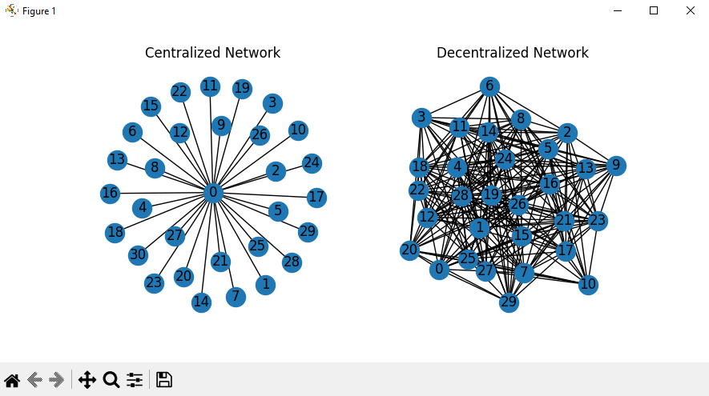

# Network Simulation: Centralized vs Decentralized

This Python code simulates the distribution of information in both centralized and decentralized networks using the NetworkX library. It provides a visual comparison of the two network types and demonstrates the differences in how information propagates through each type of network.

## Program Output

## Usage

1. Install required dependencies: `networkx`, `matplotlib`
2. Run the script: `python network_simulation.py`

## License

This project is licensed under the [MIT License](LICENSE).